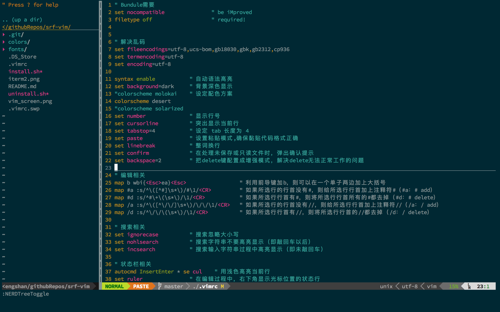
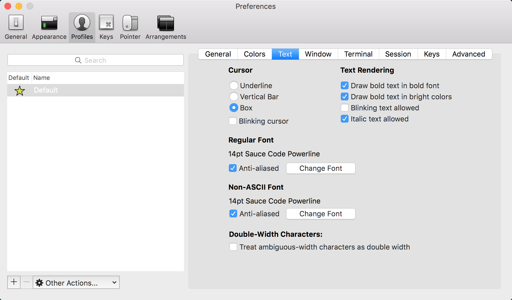

## 简介
这是我自己的vim配置，保存在此主要方便自己使用。

### 运行截图



### 如何使用

#### 1. 安装
打开客户端，执行:
```
wget -qO- https://github.com/aaronshan/srf-vim.git/master/install.sh | sh -x
```

#### 2. 卸载

打开客户端，执行:
```
wget -qO- https://github.com/aaronshan/srf-vim.git/master/uninstall.sh | sh -x
```

### 配置iterm2使用powerline字体



